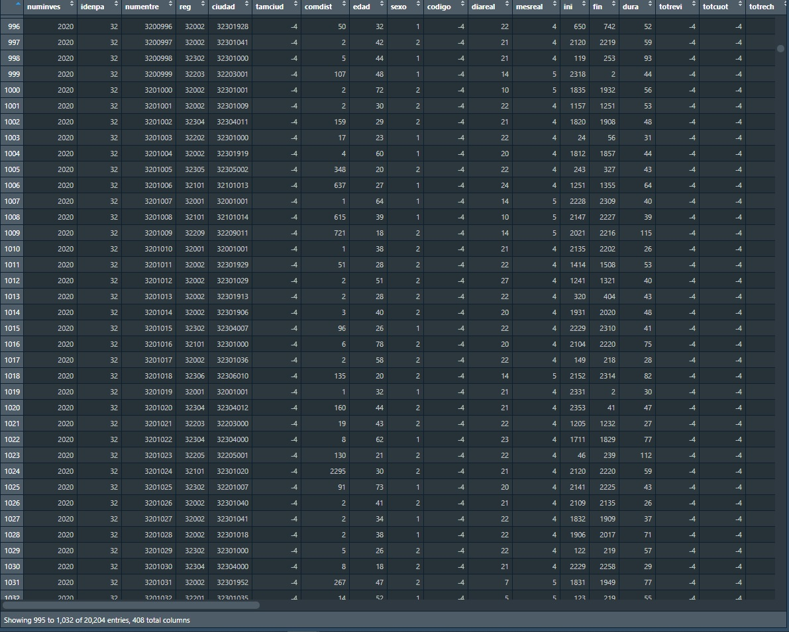
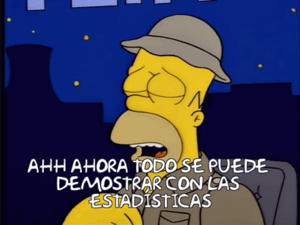
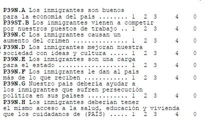

# Estos son los datos

.pull-left[

]
--

.pull-left[- En principio no muestran nada.
- Los gráficos comunican un trabajo de nuestra responsabilidad, no un reflejo inmediato de los datos.
- No hay respuestas únicas (pero sí mejores).
]

--
.pull-right[

]

---

# ¿Por qué "reportes de datos de encuestas"?

--

- No es un curso exhaustivo de GGplot
- Se excluyen visualizaciones demasiado detalladas que suelen servir para investigación (dispersión, modelamientos, etc)
- **Omitiremos uso de ponderadores**
- El foco estará en comunicar hallazgos generales de una encuesta, en contextos en que no se puede profundizar (más útil y necesario de lo que suena)
- Aportes principales: introducción a la lógica de GGplot, a los dilemas de la comunicación de datos y a la discusión sobre cómo transmitir diferentes tipos de resultados de forma eficaz y **honesta**

--

# ¿Qué es GGplot?

--

- Un paquete de la familia tidyverse (lenguaje distinto de Rbase)
- Construye gráficos a partir de capas
- Lenguaje propio cuyo aprendizaje aumenta exponencialmente

---

# Abrir/instalar paquete

```{r direct, include=FALSE}

#Directorio

setwd("C:/Users/nselame/Documents/GitHub/taller_ggplot_beneficio")
```

```{r pac y base, warning=FALSE, message = FALSE}
#Cargar paquete

library(ggplot2)
library(dplyr) #Para modificar datos con lenguaje simplificado
library(forcats) #fct_relevel

```

--

```{r pac2, include=TRUE}

#Alternativa para cuando no se sabe si paquete está instalado

# paquetes <- c("ggplot2", "dplyr")

# for(p in paquetes){
#   if (!require(p,character.only = T))  
#  install.packages(p, repos = #"http://cran.us.r-project.org");
#  library(p,character.only = T) }

```

---

# Primera capa

- Necesitaremos primero una base donde identificar las variables de interés
- Para este ejemplo rápido usaremos la base mtcars (que viene con Rbase)

```{r ejemplo 1, include=TRUE}

# Cargamos base de ejemplo

data(mtcars)

#Visualizamos una parte de la base

head(mtcars[, c(2,6)])

mtcars<- mtcars %>% mutate(cilindros=cyl,
                  peso=wt)

```

---

# Primera capa (2)

- Todo gráfico de ggplot necesita que le especifiquemos una base y los ejes
- El primer término de la línea define la base de datos a usar, `mtcars`
- Luego definimos la figura del gráfico, en este caso `geom_point` (que también puede ser `geom_bar` o `geom_smooth`)
- Dentro del término que define la figura especificamos los ejes X e Y
```{r ejemplo 1a, include=TRUE}

ejemplo1<- ggplot(mtcars)+geom_point(aes(x=cilindros, y=peso))

```
.pull-left[
```{r ejemplo 1b, include=TRUE, out.width = '250px'}

ejemplo1

```
]

--
.pull-right[

- ¿Qué nos demuestra este gráfico?
- ¿Qué problema tendríamos si usamos bases de datos más grandes?
- ¿Existen variables que serían poco útiles para un gráfico de este tipo?
]

---

# Primera capa (3)

- En general, el gráfico de puntos expresa mal la información cuando:
 1. Aumentan nuestros casos
 2. Disminuyen nuestras categorías (sobre todo en variables dicotómicas)
- Ejemplo: la variable `Species` (tres valores) en base de datos `iris` (150 casos)

--

.pull-left[
```{r ejemplo 2, include=TRUE, out.width = '250px'}

data(iris)

ggplot(iris)+geom_point(aes(x=Species, y=Petal.Width))


```
]

--
.pull-right[

- Problema: el gráfico da la impresión de que las especies no se distribuyen uniformemente

```{r ejemplo2b, include=TRUE}

table(iris$Species)

```
]

---

# Recordatorio: la solución depende del problema

- Tenemos que tener claro qué queremos comunicar para decidir cómo presentar datos
- Los gráficos no siempre serán la mejor solución
- A mí se me ocurrió que, para estas variables, era mejor presentar los descriptivos. Pero es discutible.

--

```{r ejemplo2c, include=TRUE}

iris %>% group_by(Species) %>% summarise(n=n(),
                                         media=mean(Petal.Width),
                                         mediana=median(Petal.Width),
                                         desviacion=sd(Petal.Width))

```

---

# ...volviendo a la Primera capa (4)

- Con sus dificultades, `geom_point` permite traducir directamente datos a un gráfico.
- Por su parte, `geom_smooth` genera una especie de "resumen" que también podemos extraer directo desde la base

Volvamos al caso de los cilindros y el peso:

--

.pull-left[
```{r ejemplo3, include=TRUE, warning=FALSE, message=FALSE, out.width = '250px'}
ggplot(mtcars)+geom_smooth(aes(x=cilindros, y=peso))
```
]

--

.pull-right[
```{r ejemplo3a, include=TRUE, warning=FALSE, message=FALSE, out.width = '250px'}
ejemplo1+geom_smooth(aes(x=cilindros, y=peso))
```
]

---

# Primera capa (5)

- Hasta ahora hemos graficado directamente desde la base
- GGplot puede realizar algunos cálculos (ej: frecuencias),
pero el techo es bajo
- Lo recomendable: hacer tablas (derecha)

--
.pull-left[
```{r geombar, include=TRUE, warning=FALSE, message=FALSE, out.width = '250px'}

#stat=count aplica por defecto
ggplot(mtcars) + geom_bar(aes(x=cilindros), stat="count")


```
]

.pull-right[
```{r geombart, include=TRUE, warning=FALSE, message=FALSE, out.width = '250px'}
tabla<- mtcars %>% count(cilindros) %>%
       mutate(cilin2=c("seis", "cuatro", "ocho"))
ggplot(tabla) + geom_bar(aes(x=cilin2, y=n), stat="identity")
```
]

---

# "Trabajar" los datos

- El gráfico anterior resultó casi igual con y sin una tabla intermedia
- Sin embargo, la tabla empieza a resultar más útil cuando queremos transmitir otra información, como las proporciones:

```{r geombart2, include=TRUE, warning=FALSE, message=FALSE}
tabla<- mtcars %>% count(cilindros) %>%
       mutate(cilin2=c("seis", "cuatro", "ocho"),
              porc=n*100/sum(n))
```

```{r geombart3, include=TRUE, warning=FALSE, message=FALSE, out.width = '250px'}
ggplot(tabla) + geom_bar(aes(x=cilin2, y=porc), stat="identity")+
  scale_y_continuous(limits=c(0,100))
``` 


---
class: inverse

# Conclusiones sobre la primera capa

- Podemos variar entre gráficos de puntos, barras y líneas
- Siempre debemos definir una base y variables para usar en el eje X e Y
- Algunos formatos nos permiten graficar directo desde la base de datos, pero generalmente es mejor "trabajar" la información en función de lo que queremos comunicar
- Esto último es más importante al lidiar con "bases reales"


---

class: inverse, center, middle

# "Bases reales"

---

# Bivariados

- El primer problema que enfrentamos es la presentación de datos bivariados
- Hay que ver cómo se ordenan la información (lo que es desafiante en cuanto a decisiones y programación)
- Veremos ejemplos con Latinbarómetro y las variables más comunes


```{r base, include=TRUE}
load("bases/Latinobarometro_2020_Esp_Rdata_v1_0.rdata")

base<- Latinobarometro_2020_Esp

#Una conversión de variables y sus polémicas

 base<- base %>% 
        mutate(edad_tram=case_when(edad<31 ~ "18 a 30",
                                   edad>30 & edad<45 ~ "31 a 44",
                                   edad>44 & edad<55 ~ "45 a 54",
                                   edad>54 ~ "55 o más"),
               pos=case_when(p18st %in% c(0,1,2,3) ~ "izq",
                             p18st %in% c(4,5,6) ~ "cent",
                             p18st %in% c(7,8,9,10) ~ "der"))


```

---

# Bivariados (2)

- Se observan claras diferencias al intentar graficar "directo" y tratar las variables
- Ejemplifiquemos con edad y posición política

--
.pull-left[
```{r pos_edad1, include=TRUE, warning=FALSE, message=FALSE, out.width = '250px'}
  
ggplot(base %>%  filter(p18st>=0 & p18st<11)) + geom_point(aes(x=edad, y=p18st))

```
]

--

.pull-right[
```{r pos_edad2, include=TRUE, warning=FALSE, message=FALSE, out.width = '250px'}

edad_pos<- base %>% filter(!is.na(pos)) %>% group_by(edad_tram) %>% count(pos) %>% mutate(porc=n*100/sum(n)) 
  
ggplot(edad_pos) + geom_bar(aes(x=edad_tram, y=porc, fill=pos), stat="identity")+
  scale_y_continuous(limits=c(0,100))

```
]

---

# Bivariados 3

- Una vez que decidimos qué gráfico queda mejor, hay que mejorarlo visualmente

--

```{r pos_edad2a, include=TRUE, warning=FALSE, message=FALSE, out.width = '250px'}

grafico_lindo<- ggplot(edad_pos) + (aes(x=edad_tram, y=porc, fill=fct_relevel(pos,
                                                              "izq",
                                                              "cent",
                                                              "der")))+
   geom_bar(stat="identity", position="dodge")+
   labs(y = "Porcentaje del grupo etario", x="Tramo etario",
       title="Posición política según edad", fill="Posición")+
  theme(panel.grid.major = element_blank(), 
        panel.grid.minor = element_blank(),
        panel.background = element_blank(),
        axis.line.x = element_line(colour = "black"))+
  geom_text(aes(label = scales::percent(porc, scale = 1, accuracy = 0.1)),
            vjust = -1, fontface = "bold", size = 3,
            position = position_dodge(width = 0.8))+
  scale_fill_viridis_d(begin = 0, end = .7, option = 'viridis')+
  scale_y_continuous(limits=c(0,100))


```

---

# Bivariados (4)

```{r pos_edad2ac, include=TRUE, warning=FALSE, message=FALSE, out.width = '400px'}

grafico_lindo

```

---

# Bivariados (5)

Pero no necesitamos siempre escribir tanto; podemos guardar vectores con nuestro código que usaremos en varios gráficos.

.pull-left[

]

.pull-right[

]

--

```{r have a code, include=TRUE, warning=FALSE, message=FALSE, out.width = '400px'}

have_a_code<-  theme(panel.grid.major = element_blank(), 
        panel.grid.minor = element_blank(),
        panel.background = element_blank(),
        axis.line.x = element_line(colour = "black"))

scale_code<- scale_fill_viridis_d(begin = 0, end = .7, option = 'viridis')

```

---

class: center, middle

# ¿Y si son muchas preguntas?

A veces varias preguntas responden a un mismo problema y no sirve abordarlas por separado


---

# Tantas preguntas

El cómo graficar preguntas relacionadas siempre dependerá de cuál es el vínculo entre ellas, las categorías con que se responden y la necesidad de cruzar con otras variables.

Examinar las preguntas: ¿qué vemos?



---

# Tantas preguntas (2)

Problemas que atender:
1. Pensar qué es lo que resulta relevante en todo esto
1. Encontrar un formato para mostrar rápidamente cómo varían las respuestas a todas las preguntas
1. Las escalas de respuesta tienen connotaciones distintas, quizás eso confunda


---

# Tantas preguntas (3)

Propuesta:

```{r grafico inmig, include=FALSE, out.width = '400px'}
  in1 <- base %>% filter(p39n.a!=0 & !is.na(p39n.a)) %>%   mutate(p=ifelse(p39n.a <3, "A favor", "En contra")) %>% count(p) %>% mutate(porc=n*100/sum(n),
  prom=mean(base$p39n.a, na.rm=TRUE)) %>% 
    mutate(porc=ifelse(p=="En contra", porc*-1, porc),
           grup="Aportan a la economía")
  
  in2 <- base %>% filter(p39st.b!=0 & !is.na(p39st.b)) %>%   mutate(p=ifelse(p39st.b >2, "A favor", "En contra")) %>% count(p) %>% mutate(porc=n*100/sum(n),
  prom=mean(base$p39st.b, na.rm=TRUE)) %>% 
    mutate(porc=ifelse(p=="En contra", porc*-1, porc),
           grup="Compiten por trabajos")
  
  in3 <- base %>% filter(p39n.c!=0 & !is.na(p39n.c)) %>%   mutate(p=ifelse(p39n.c >2, "A favor", "En contra")) %>% count(p) %>% mutate(porc=n*100/sum(n),
  prom=mean(base$p39n.c, na.rm=TRUE)) %>% 
    mutate(porc=ifelse(p=="En contra", porc*-1, porc),
           grup="Aumentan crimen")
  
  in_t<- rbind(in1, in2, in3)

inmig<-ggplot(in_t, aes(y=porc, 
                      x=grup, fill=p)) +
  geom_bar(stat="identity", width = .9)+
  labs(fill="Percepción") +
  geom_label(label=(round(in_t$prom,1)), y=0, colour="black", fontface="bold", fill="#b1f9f4")+
  xlab("Dimensión consultada") + ylab("Porcentaje de encuestados") +
  scale_y_continuous(limits=c(-101,101))+
  geom_text(aes(label = paste0(round(porc, 1),"%")),
            position = position_stack(vjust=.5),
            size=3.5, colour="white", fontface="bold") + 
  have_a_code+
  scale_fill_manual(values=c("blue1", "red1"))


```

```{r muestra grafico inmig, echo=FALSE, out.width = '450px'}

inmig

```

---

# Tantas preguntas (4)

¿Cómo llegamos a ese gráfico? necesitamos una sola tabla que indique: 
1. El promedio de respuesta a las preguntas
1. Proporciones de respuestas en clave positiva y negativa
1. Unificar toda esta información

```{r tablas inmig, include=TRUE, eval=FALSE}
in1 <- base %>% filter(p39n.a!=0 & !is.na(p39n.a)) %>% 
     mutate(p=ifelse(p39n.a <3, "A favor", "En contra")) %>% count(p) %>%
     mutate(porc=n*100/sum(n),
            prom=mean(base$p39n.a, na.rm=TRUE)) %>% 
     mutate(porc=ifelse(p=="En contra", porc*-1, porc),
            grup="Aportan a la economía")
  
in2 <- base %>% filter(p39st.b!=0 & !is.na(p39st.b)) %>% 
    mutate(p=ifelse(p39st.b >2, "A favor", "En contra")) %>% count(p) %>%
    mutate(porc=n*100/sum(n),
           prom=mean(base$p39st.b, na.rm=TRUE)) %>% 
    mutate(porc=ifelse(p=="En contra", porc*-1, porc),
          grup="Compiten por trabajos")

in_t<- rbind(in1, in2)
```
---

# Tantas preguntas (5)

La tabla se ve así:

```{r tablas inmig2, include=TRUE}
 
in_t

```

---
# Tantas preguntas (6)

Ahora usamos esa tabla única para graficar:
    
```{r grafico inmig mostrar, include=TRUE}

inmig<-ggplot(in_t, aes(y=porc, x=grup, fill=p)) +
              geom_bar(stat="identity", width = .9)+
              labs(fill="Percepción") +
              geom_label(label=(round(in_t$prom,1)), y=0, colour="black",
                         fontface="bold", fill="#b1f9f4")+
          xlab("Dimensión consultada") + ylab("Porcentaje de encuestados") +
          scale_y_continuous(limits=c(-101,101))+
          geom_text(aes(label = paste0(round(porc, 1),"%")),
            position = position_stack(vjust=.5),
            size=3.5, colour="white", fontface="bold") + 
         have_a_code+  #Nuestro código guardado!
         scale_fill_manual(values=c("blue1", "red1"))

```

---

class: center, middle, inverse

# En defensa del `geom_point`


---

# Salvando los puntos


```{r nuevos arreglos, include=FALSE}

load("bases/ltbr_2020_r.Rdata")

base2<- Latinobarometro_2020_Esp

base2 <- base2 %>% mutate(across(
  everything(), ~ifelse(. %in% c(-1, -2, -3, -4, -5), NA_real_, .)))

base2<- base2 %>% mutate(sex=ifelse(sexo==1, "Men", "Women"),
                         abor=(p70st-11)*-1,
                         edad_t2=case_when(edad<36 ~ "18-35",
                                          edad>35 ~ "Más de 35"),
                         pais=case_when(idenpa==32 ~"Argentina",
                                      idenpa==68 ~"Bolivia",
                                      idenpa==76 ~"Brazil",
                                      idenpa==152 ~ "Chile",
                                      idenpa==170 ~ "Colombia",
                                      idenpa==188 ~ "Costa Rica",
                                      idenpa==214 ~ "Dominican Rep.",
                                      idenpa==218 ~ "Ecuador",
                                      idenpa==222 ~ "El Salvador",
                                      idenpa==320 ~ "Guatemala",
                                      idenpa==340 ~ "Honduras",
                                      idenpa==484 ~ "Mexico",
                                      idenpa==558 ~ "Nicaragua",
                                      idenpa==591 ~ "Panama",
                                      idenpa==600 ~ "Paraguay",
                                      idenpa==604 ~ "Peru",
                                      idenpa==724 ~ "Spain",
                                      idenpa==858 ~ "Uruguay",
                                      idenpa==862 ~ "Venezuela"))


tab_abor_c<-base2%>%  group_by(sex, pais) %>% 
  summarise(media= mean(abor,  na.rm=TRUE),
            sd= sd(abor, na.rm=TRUE),
            n=n(),
            se= sd/sqrt(n))

tab_abor_c2<-base2%>%  group_by(sex, pais, edad_t2) %>% 
  summarise(media= mean(abor,  na.rm=TRUE),
            sd= sd(abor, na.rm=TRUE),
            n=n(),
            se= sd/sqrt(n))

abor_c<- ggplot(tab_abor_c, aes(x=media, y=pais, colour=sex)) +
  geom_point(size=2, position=position_dodge(width=0.5))+
  geom_errorbar(aes(xmin=media-se, xmax=media+se),
                position=position_dodge(width=0.5),  width=.2)+
  scale_x_continuous(limits=c(6.5,9.5), breaks= seq(6.5,9.5, by=.5)) +
  scale_y_discrete(limits=rev)+
  have_a_code+
  ylab("")+xlab("Agreement with abortion")+ 
  labs(colour="Sex", caption="1-10 scale where 1 means 'It is always justified'\n and 10 means 'it is never justified'")+
  scale_color_manual(values = c("Men" = "black", "Women" = "grey"))


abor_c2<- ggplot(tab_abor_c2, aes(x=media, y=pais, colour=sex)) +
  geom_point(size=2, position=position_dodge(width=0.5))+
  geom_errorbar(aes(xmin=media-se, xmax=media+se),
                position=position_dodge(width=0.5),  width=.2)+
  scale_x_continuous(limits=c(6.5,9.5), breaks= seq(6.5,9.5, by=.5)) +
  scale_y_discrete(limits=rev)+
  theme(panel.grid.major = element_blank(), panel.grid.minor = element_blank(),
        panel.background = element_blank(), legend.key=element_blank(),
        axis.line.x = element_line(colour = "black"))+
  facet_wrap(~edad_t2)+
  ylab("")+xlab("Agreement with abortion")+ 
  labs(colour="Sex", caption="1-10 scale where 1 means 'It is always justified'\n and 10 means 'it is never justified'")+
  scale_color_manual(values = c("Men" = "black", "Women" = "grey"))

```


.pull-left[
```{r aborto pres, echo=FALSE}

abor_c

```
]

.pull-right[
En realidad, sí son un formato muy útil si trabajamos los datos y sabemos qué queremos mostrar
]
---

# Salvando los puntos (2)

.pull-left[
```{r aborto pres2, echo=FALSE}

abor_c2

```
]

.pull-right[
Y no podemos cerrar el taller sin introducir `facet_wrap`
]

---

# Salvando los puntos (3)

¿Cómo se hizo eso?
- Primero con tablas distintas
- Hay que tener claro qué queremos ilustrar con los puntos

```{r tablas abor, include=TRUE, warning=FALSE, message=FALSE}
tab_abor_c<-base2%>%  group_by(sex, pais) %>% 
  summarise(media= mean(abor,  na.rm=TRUE),
            sd= sd(abor, na.rm=TRUE),
            n=n(),
            se= sd/sqrt(n))

#Con agrupación edad

tab_abor_c2<-base2%>%  group_by(sex, pais, edad_t2) %>% 
  summarise(media= mean(abor,  na.rm=TRUE),
            sd= sd(abor, na.rm=TRUE),
            n=n(),
            se= sd/sqrt(n))
```

---

# Salvando los puntos (4)

Analicemos el código

```{r graficos aborto, include=TRUE}

abor_c<- ggplot(tab_abor_c, aes(x=media, y=pais, colour=sex)) +
  geom_point(size=2, position=position_dodge(width=0.5))+
  geom_errorbar(aes(xmin=media-se, xmax=media+se),
                position=position_dodge(width=0.5),  width=.2)+
  scale_x_continuous(limits=c(6.5,9.5), breaks= seq(6.5,9.5, by=.5)) +
  scale_y_discrete(limits=rev)+
  have_a_code+
  ylab("")+xlab("Agreement with abortion")+ 
  labs(colour="Sex", caption="1-10 scale where 1 means 'It is always justified'\n and 10 means 'it is never justified'")+
  scale_color_manual(values = c("Men" = "black", "Women" = "grey"))

#Sólo un facet_grid(~edad_t2) basta para segmentar por grupos

```

---

class: inverse

# A modo de cierre

- El mundo de GGplot es prácticamente infinito; revisar ejemplos y googlear es clave para encontrar nuevos elementos y armar soluciones creativas
- Siempre debemos tener claro cuáles son los cálculos detrás de cada gráfico, y aceptar discusión sobre la forma en que construimos categorías, excluimos valores o seleccionamos casos
- Para añadir ponderadores basta incluirlos en los cálculos de las tablas previas a graficar

---

class: center, middle

# ¿Preguntas?


---

class: center, inverse, middle

# Muchas gracias

Nicolás Selamé

Contacto: naselame@uc.cl


